author: AKIBAホールディングス 情報システム部
summary: Antigravity の基本操作を学ぶ社内スタートガイド。インストール・Agent Manager・ブラウザ操作まで、ステップごとに学べます。
id: antigravity-getting-started
categories: DX,AI活用
environments: Web
status: Published
feedback link: https://internal-dx-portal-auth.tanjiadm.workers.dev/

# Antigravity 使い方入門

## はじめに
Duration: 2:00

このCodelabでは **Google Antigravity** の基本操作をステップごとに学びます。

Antigravity は AI エージェント型の開発・業務支援プラットフォームです。従来の「1行ずつ提案するAIツール」とは異なり、**タスク全体を AI が自律的に計画・実行**します。

### このCodelabで学ぶこと

- Antigravity の基本概念と従来ツールとの違い
- インストールと初期セキュリティポリシーの設定
- Agent Manager の使い方（Planning / Fast モード）
- Antigravity ブラウザ機能の設定と活用
- Artifacts・Inbox・Editor の概要

### 必要な環境

- **Google Workspace アカウント**（会社の Gmail アドレス）
- **Windows または macOS** のパソコン
- **Chrome ブラウザ**（Browser 機能を使う場合）
- 所要時間：約 60 分

<aside class="positive">
プログラミングの知識は不要です。日本語の自然な指示で操作できます。
</aside>

## Antigravity とは
Duration: 5:00

Google が提供する AI エージェント型の開発・業務支援環境です。コードを1行ずつ提案する従来ツールとは違い、**タスク全体を AI が自律的に計画・実行**します。

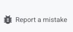

### 従来のAIツールとの違い

| | 従来のAIツール | Antigravity |
|---|---|---|
| 動き方 | 1行ずつ提案 | タスクを丸ごと依頼 |
| 人間の役割 | コードを組み立てる | レビューと方向修正 |
| 作業記録 | なし | Artifacts に完全記録 |
| 並行処理 | 1件ずつ | 複数エージェント同時実行 |

### Agent Manager

AI エージェントの管制室。複数のエージェントを並列で管理する。

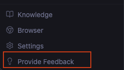

### Editor

VS Code ベースのコードエディタ。AI が並走してコードを補助する。

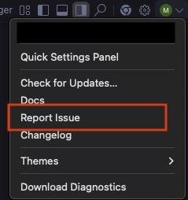

### AIとあなたの役割分担

**AIが担当**
- タスクの計画を立てる
- 必要なファイルを調べる
- コードや文書を作成・修正する
- 結果を報告する

**あなたが担当**
- やりたいことを伝える
- AI の計画をレビューする
- 方向が違えば修正指示を出す
- 最終確認して承認する

<aside class="positive">
「調べてまとめて」「この書類を直して」のような自然な日本語で指示できます。
</aside>

## インストール
Duration: 15:00

ダウンロードからサインインまで約15分。**Google Workspace アカウント**でログインします。

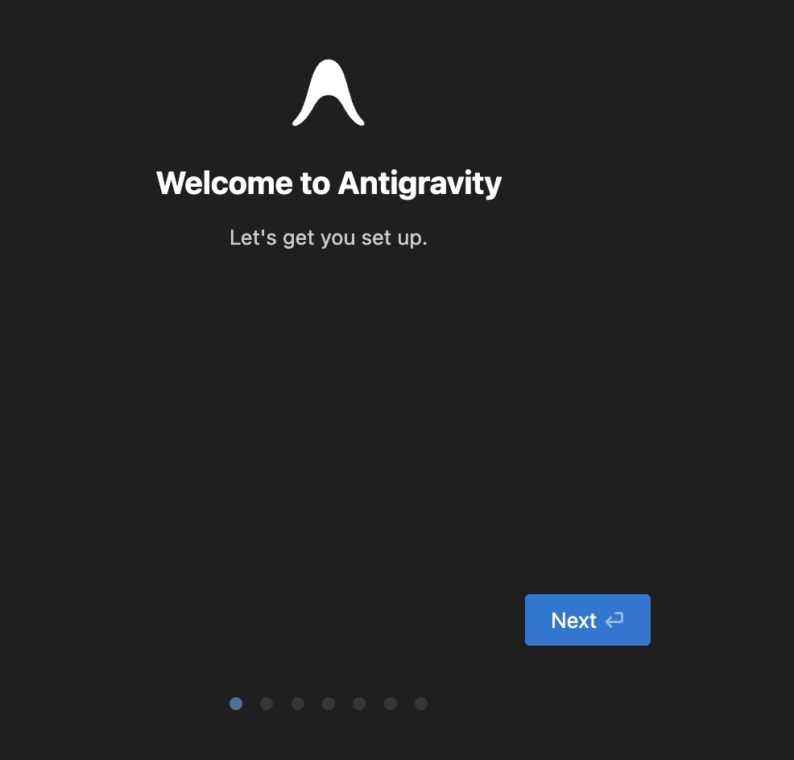

### インストール手順

**1. ダウンロード**

`antigravity.google/download` から OS に合ったインストーラーを取得する

**2. 初期設定**

セットアップで「Start fresh」を選択。テーマはダーク or ライト（好みで選択）

**3. セキュリティポリシー設定**

セットアップウィザード内で選択する。**「Review-driven development」を推奨**。後から変更する場合は **Settings → Agent** で設定

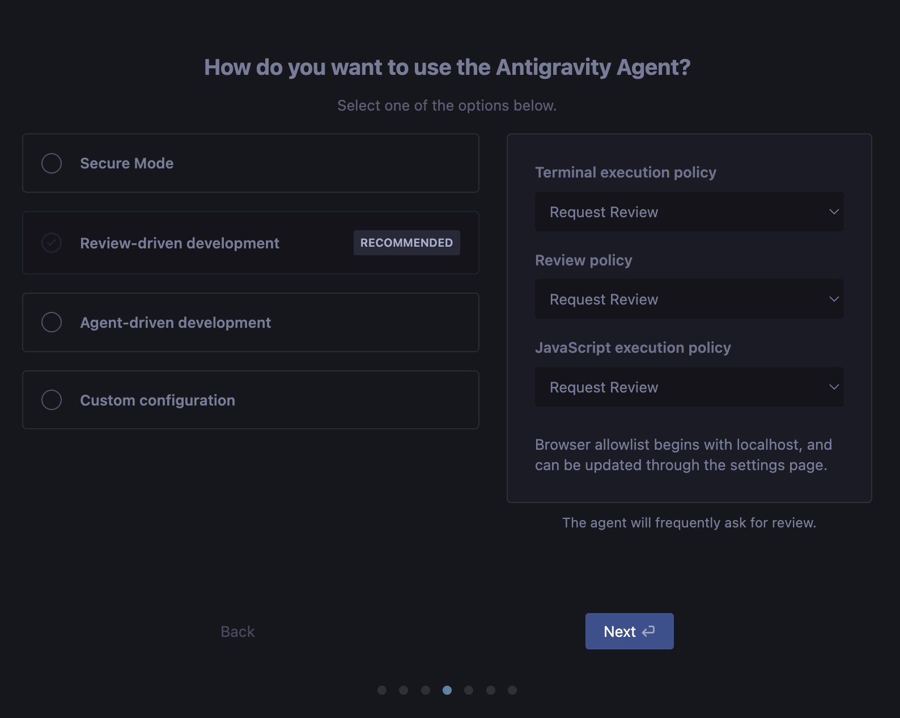

**4. サインイン**

Google Workspace アカウントでログインする（プレビュー期間中は無料）

### セキュリティポリシーの選択肢

初期設定時に、AI の動作範囲を3つの観点で制御します。

**ターミナル実行ポリシー**
- `Always proceed` — コマンドを自動実行（拒否リスト以外）
- `Request review` — 実行前に毎回確認を求める

**レビューポリシー**
- `Always Proceed` — レビューなしで作業を進める
- `Agent Decides` — AI が必要と判断した場合のみレビュー依頼
- `Request Review` — 毎回レビューを求める

**JavaScript 実行ポリシー**
- `Always Proceed` — ブラウザ上の JavaScript を自動実行
- `Request review` — 実行前に確認を求める
- `Disabled` — JavaScript の実行を完全に禁止

### 推奨セキュリティプリセット

| プリセット | 概要 | 対象 |
|---|---|---|
| Secure Mode | 外部リソース・機密操作を制限 | 慎重に使いたい方 |
| **Review-driven ✓** | AIが頻繁にレビューを求める | **初めての方（推奨）** |
| Agent-driven | AIがレビューなしで作業を進める | 慣れた方向け |
| Custom | ポリシーを個別設定 | 上級者向け |

<aside class="negative">
社内ネットワークで接続できない場合は情報システム部に連絡してください。接続先は `antigravity.google` 関連ドメインです。
</aside>

## Agent Manager
Duration: 10:00

AI エージェントの「管制室」。新しい会話を始めるとエージェントが1つ起動し、指示に従ってタスクを実行します。

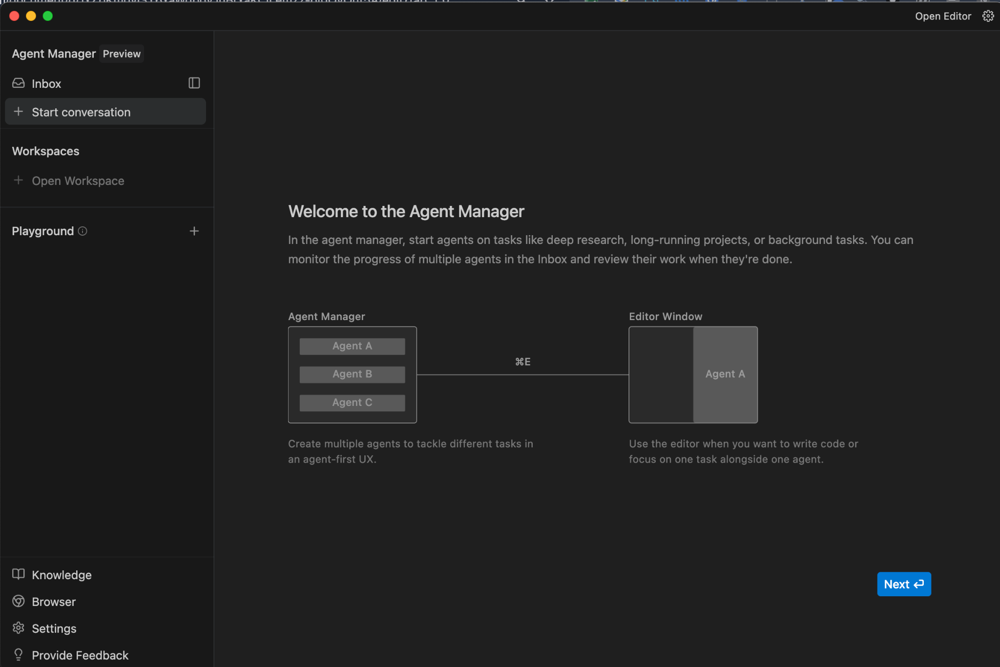

### ワークスペース選択

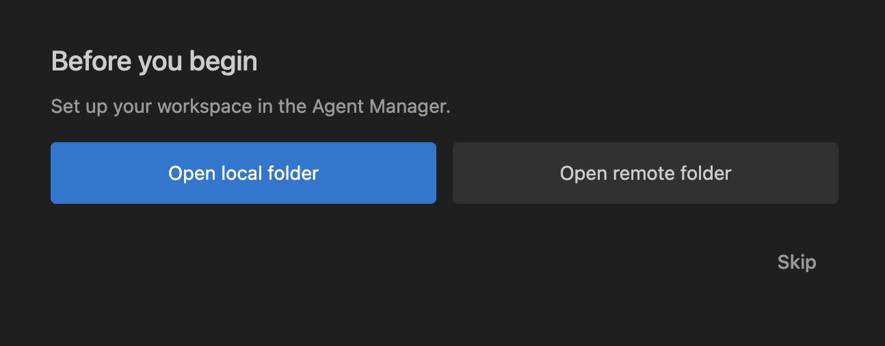

### Agent Manager ウィンドウ

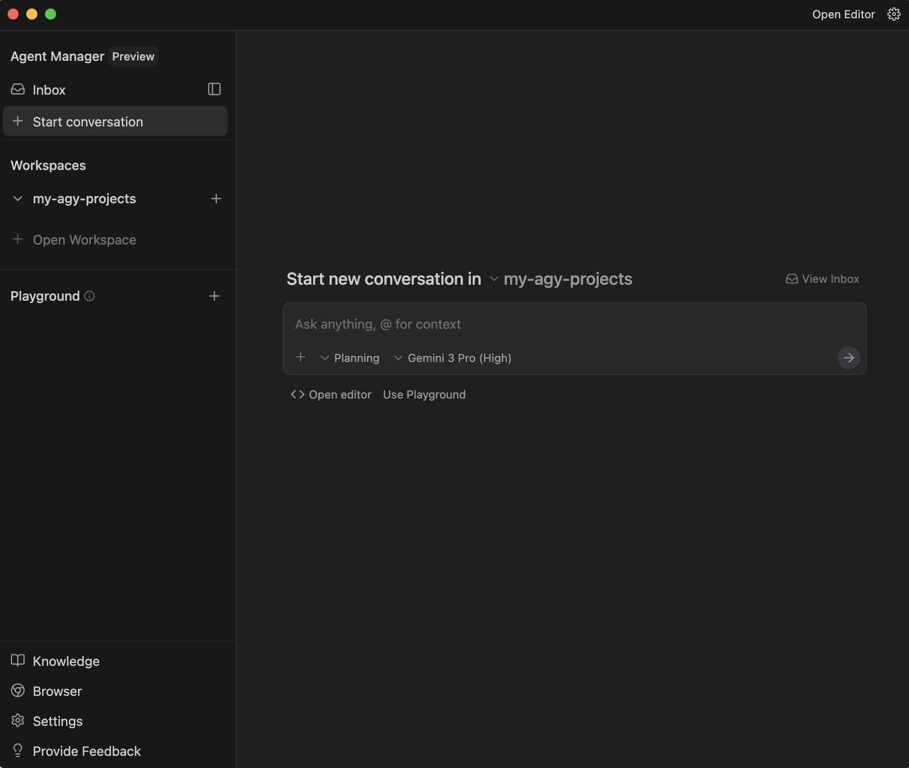

### モデル選択

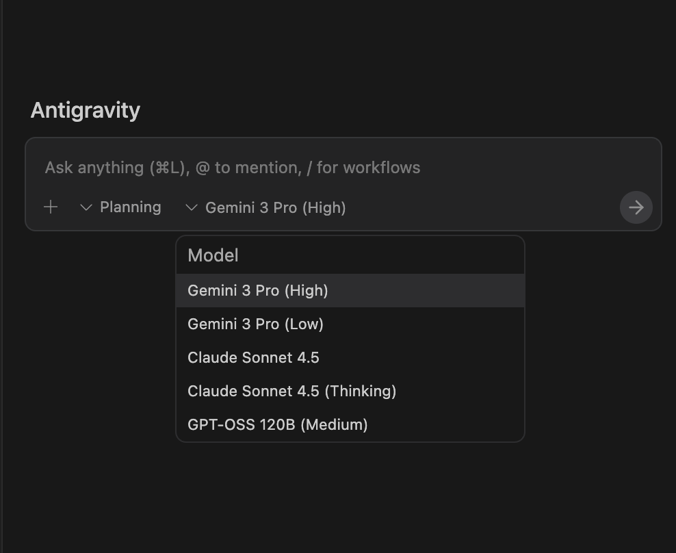

### プランニングモード

### 各部位の説明

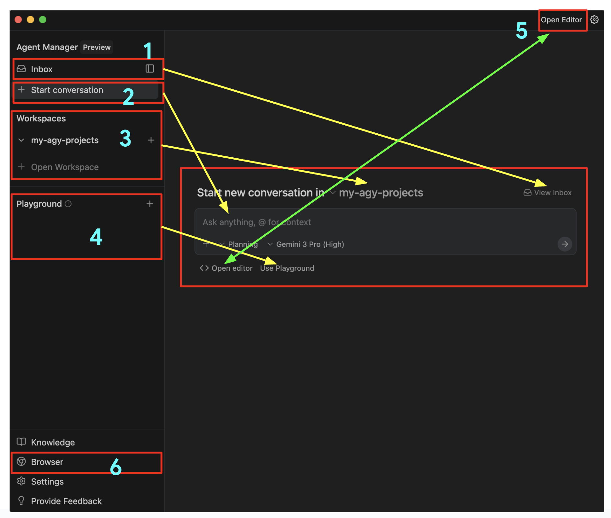

### 実行モードの選択

**Planning モード（推奨）**

AI がまず計画を立ててから実行する。計画の段階でレビューできるので安心。

用途: 調査・分析・複数ファイルの変更

**Fast モード**

計画なしで即座に実行。単純な作業を素早く処理する。

用途: リネーム・フォーマット修正・簡単な質問

### Agent Manager の主な機能

- **Inbox** — すべての会話を一覧表示。タスク状況・承認待ちリクエストを確認する
- **Workspaces** — プロジェクトフォルダを追加・管理する。Playground で試してから本番に移行も可能
- **承認待ちリクエスト** — 各エージェントの進捗状況・成果物・承認待ちの操作を一覧で確認する

### 複数エージェントの同時実行

従来のチャット型ツールは1つずつ順番に処理するが、Agent Manager では複数のエージェントを同時に起動できます。

例: 5件の資料作成を5つのエージェントに同時に割り当て、並行して処理する

<aside class="positive">
迷ったら Planning モードを使いましょう。計画の段階で「方向が違う」と気づけば、実行前に修正できます。
</aside>

## ブラウザ機能（Browser）
Duration: 10:00

Chrome 拡張をインストールすると、AI に Web ブラウジング能力を付与できます。調査やデータ収集を自動化します。

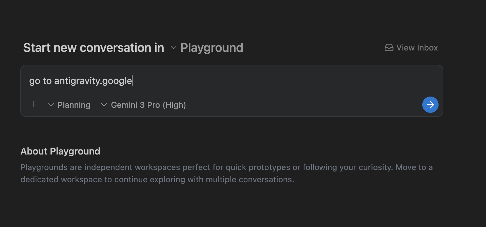

### セットアップ開始

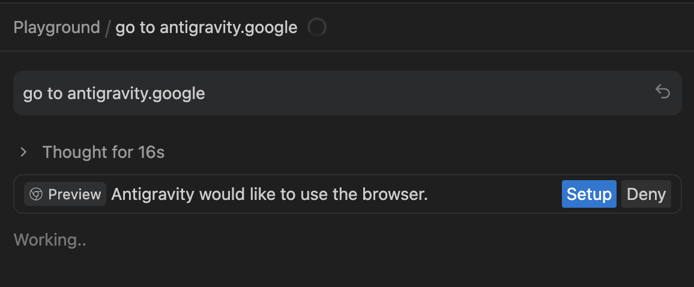

### Chrome 拡張のインストール

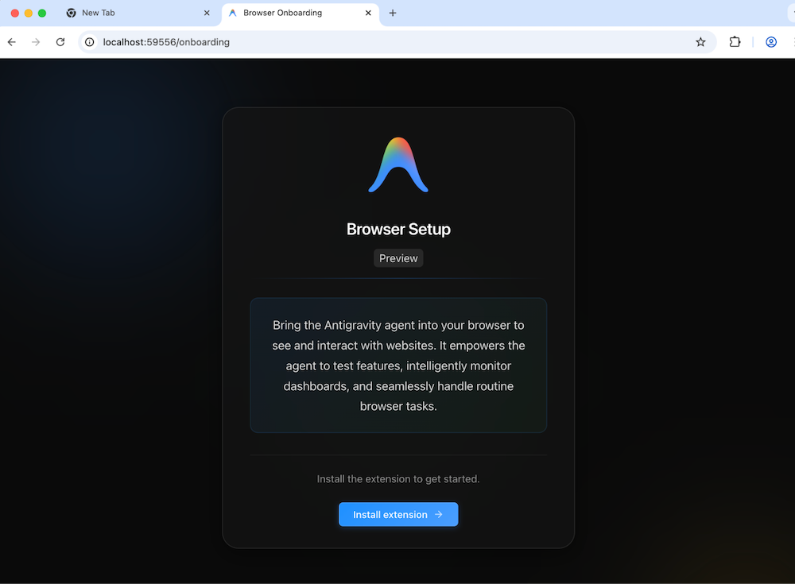

### セットアップ手順

**1. 拡張機能のインストール**

Agent Manager の設定から Chrome ウェブストアに移動し、「Antigravity Browser」拡張機能をインストールする

**2. アクセス許可の設定**

拡張機能のインストール後、サイトへのアクセス許可を設定する（読み取り専用を推奨）

**3. 動作確認**

Agent Manager に戻り、ブラウザアイコンが有効になっていることを確認する

### Browser でできること

- 指定した Web サイトの情報収集・要約
- 複数ページにまたがる情報の横断検索
- フォームへの自動入力（JavaScript 許可が必要）
- 定期的なページ監視と変更検知

<aside class="negative">
JavaScript 実行ポリシーを「Always Proceed」にするとリスクが高まります。社内利用では「Request review」を推奨します。
</aside>

## Artifacts
Duration: 5:00

AI の作業成果物がすべて記録される仕組み。「AI が本当にこの作業をしたか」を確認できます。

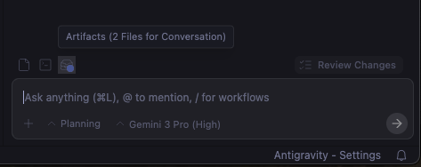

### Agent Manager の Artifacts

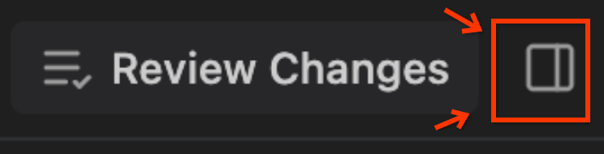

### Artifacts ビュー

### Review Changes

### Artifact の種類

- **タスクリスト** — コーディング前の計画。AI が何をするか一覧で確認できる
- **実装計画** — どのファイルをどう変更するかの技術的な設計書
- **ウォークスルー** — 実装完了後の変更内容とテスト手順のまとめ
- **コード Diff** — 変更前後の差分を行単位で表示する
- **スクリーンショット** — UI の変更前後の状態をキャプチャする
- **ブラウザ記録** — 操作の動画記録

### Artifacts の確認方法

- **Editor 画面**: 右下の「Artifacts」ボタンから確認
- **Agent Manager 画面**: 右上の「Review changes」横のトグルボタンで成果物一覧を表示

<aside class="positive">
「Review Changes」ボタンで変更を適用前に確認できます。承認しない限りファイルは変更されません。
</aside>

## Inbox
Duration: 3:00

過去の会話がすべて保存される中央ハブ。複数のエージェントが同時に進行する作業を一覧で管理します。

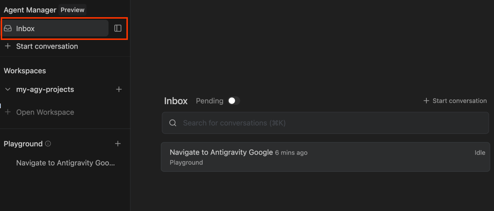

### Inbox 詳細

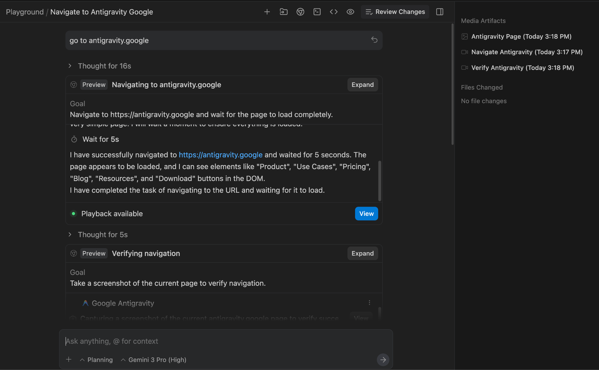

### Inbox でできること

- 会話の履歴（やり取りの全文）を確認
- 各エージェントが生成した成果物（Artifacts）を参照
- タスクの進捗状況・承認待ちリクエストを管理
- 同時に走っている複数タスクを一覧で把握

<aside class="positive">
「先週やった○○の続き」と言えば、AI が過去の文脈を引き継いで作業を再開します。
</aside>

## Editor
Duration: 8:00

VS Code ベースのエディタ。従来の操作感はそのままに、AI エージェント機能が統合されています。

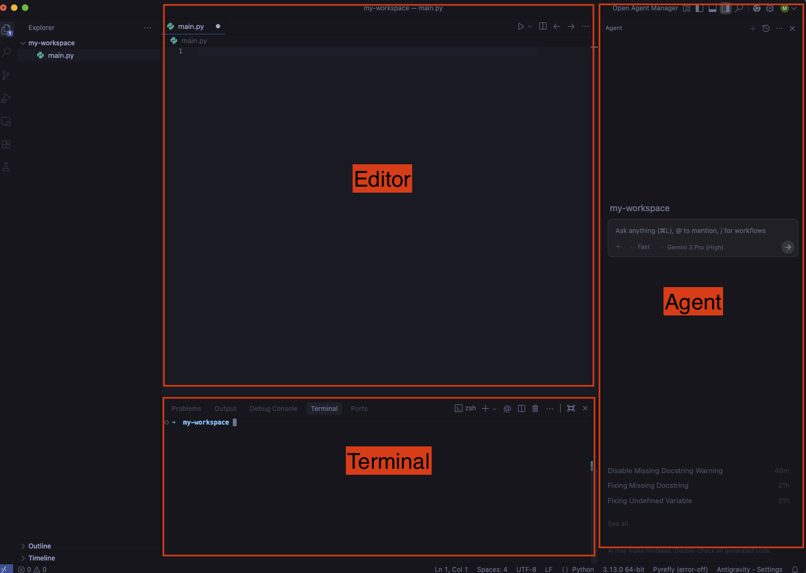

### セットアップ

エディタ・ターミナル・エージェントパネルを同時に表示できます。ショートカット: `Ctrl + `` でターミナル、`Ctrl + L` でエージェントパネル。

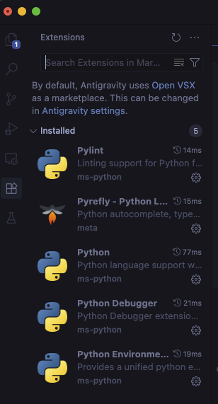

### Auto-complete

入力中に AI が続きを提案します。`Tab` で確定。

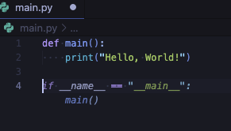

### Tab to Import

不足しているライブラリの読み込み文を自動提案します。

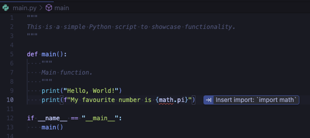

### Tab to Jump

カーソルを論理的な次の編集箇所に自動移動します。

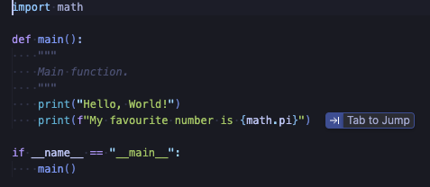

### インラインコマンド（Ctrl + I）

エディタまたはターミナルで `Ctrl + I` を押すと、その場で AI に指示を出せます。

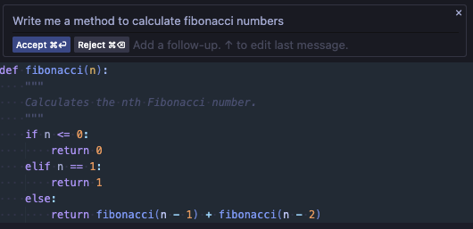

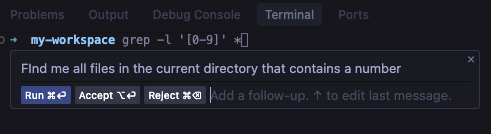

### Agent サイドパネル（Ctrl + L）

`Ctrl + L` で開きます。`@` でファイル・コードをコンテキストに追加、`/` でワークフローを呼び出せます。

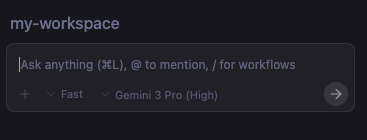

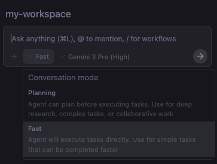

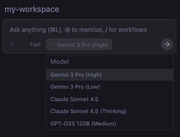

### Explain and Fix

コードをハイライト → 右クリック → AI に説明・修正を依頼します。

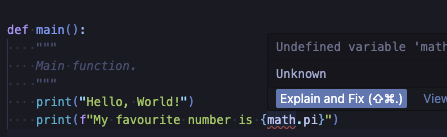

### Send problems to agent

エラーパネルの問題をワンクリックでエージェントに送信し、自動修正を依頼します。

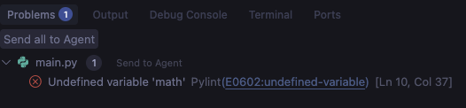

### Send terminal output to agent

ターミナルの出力（エラーログ等）をそのままエージェントに送り、原因分析・修正を依頼します。

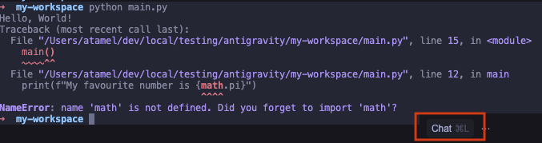

<aside class="positive">
プログラミングに限らず、文書ファイル（Markdown, HTML, テキスト等）の編集にも使えます。
</aside>

## まとめ
Duration: 3:00

お疲れ様でした。このCodelabで学んだことを振り返りましょう。

### 学習のポイント

- Antigravity は「AIエージェント」であり、タスクを自律的に計画・実行する
- インストール時は **Review-driven** ポリシーを選択する
- Agent Manager で複数エージェントを並行管理できる
- Planning モードで計画を確認してから実行する習慣をつける
- Artifacts で変更内容を必ず確認してから承認する

### 次のステップ

- 詳細版操作ガイドを読む
- セキュリティガイドラインを確認する
- まず Playground ワークスペースで気軽に試してみる

### サポート

操作で困ったことがあれば情報システム部にお気軽に連絡ください。

<aside class="positive">
まずは Playground で試してみましょう。本番ファイルへの影響なく、自由に Antigravity の機能を体験できます。
</aside>
