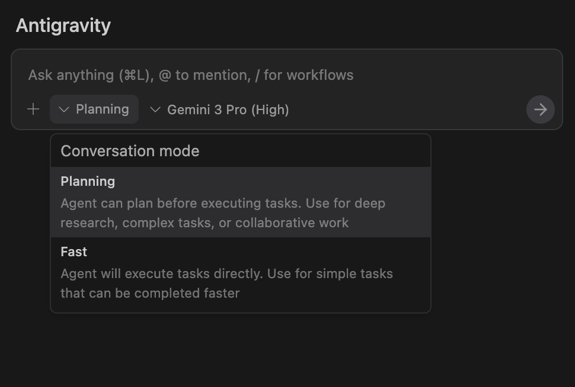
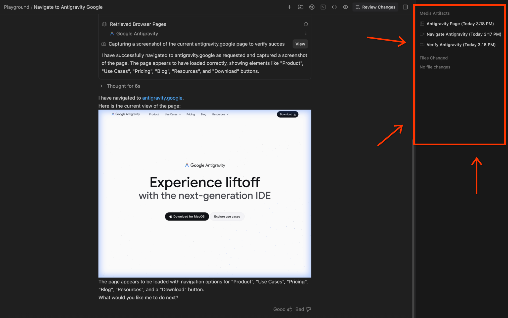
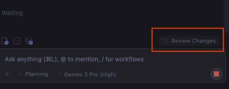

author: AKIBAホールディングス 情報システム部
summary: Antigravity の仕様駆動開発を実践で学ぶ社内研修教材。仕様書の書き方・エージェントへの指示・Artifacts確認まで、ステップごとに体験できます。
id: antigravity-spec-driven
categories: DX,AI活用
environments: Web
status: Published
feedback link: https://internal-dx-portal-auth.tanjiadm.workers.dev/

# Antigravity 仕様駆動開発 入門

## このラボの目的
Duration: 2:00

このCodelabでは **Google Antigravity** を使った **仕様駆動開発（Spec-Driven Development）** を実践します。

仕様駆動開発とは、AI エージェントに作業を依頼する前に **詳細な仕様書を書く** アプローチです。あいまいな指示で動かすのではなく、要件・制約・完成イメージを文書化してからエージェントに渡します。


### このCodelabで学ぶこと

- 「プロンプトとパッチ」との違いを理解する
- 効果的な仕様書（スペック）の書き方を習得する
- Antigravity に仕様を渡してエージェントに自動実装させる
- Artifacts で成果物を確認・承認するワークフローを身につける

### このCodelabで作るもの

**社内向け FAQ ページ** を仕様書から自動生成します。完成品は：

- 部署ごとにまとめられた Q&A（カテゴリ分類）
- キーワード検索機能
- クリックで開閉するアコーディオン形式
- スマートフォン対応のレスポンシブデザイン

### 必要な環境

- **Antigravity インストール済み**（未インストールの場合は「Antigravity 使い方入門」を先に完了してください）
- **Google Workspace アカウント**（会社の Gmail アドレス）
- 所要時間：約 55 分

<aside class="positive">
プログラミングの知識は不要です。仕様書の書き方さえ覚えれば、あとはエージェントが実装します。
</aside>

## 仕様駆動開発とは
Duration: 5:00

### 「プロンプトとパッチ」との違い

多くの人が最初にやりがちなのが **「プロンプトとパッチ」** です。

1. AI に「〇〇を作って」と送る
2. 出てきた結果を見て「ここが違う」とパッチを当てる
3. また送る → また直す → ループ

これは時間がかかり、最終的な品質もブレます。

**仕様駆動開発** では順序が変わります。

1. **先に仕様書を書く**（何を・どんな制約で・どう動くか）
2. エージェントに仕様書ごと渡す
3. エージェントが計画を立てる → レビューする
4. 承認 → 自動実装

### なぜ仕様書が重要か

| | プロンプトとパッチ | 仕様駆動開発 |
|---|---|---|
| 最初にすること | すぐ実行 | 仕様書を書く |
| 手戻り | 多い | 少ない |
| 完成物の品質 | ブレがある | 仕様通り |
| 資産性 | 毎回ゼロから | 仕様書が再利用できる |

### 良い仕様書の 3 要素

**1. 目的**

「何のために作るか」「誰が使うか」を明記する

**2. 機能要件**

「何ができなければならないか」を箇条書きで具体的に書く

**3. 制約**

「使ってよい技術・使ってはいけないこと・デザインの決まり事」を明示する


<aside class="positive">
仕様書は完璧である必要はありません。「これを作りたい」という意図が伝われば十分です。エージェントが不明点を質問してきます。
</aside>

## ワークスペースを準備する
Duration: 5:00

Antigravity を起動して、Agent Manager を開きます。

### Agent Manager を起動する


### Playground ワークスペースを選択する

左のサイドバーから **Workspaces** を選択し、**Playground** をクリックします。


<aside class="positive">
Playground は本番ファイルに影響しない安全な作業場所です。最初の練習はここで行いましょう。
</aside>

### Planning モードを確認する

Agent Manager 上部のモード選択で **Planning** が選ばれていることを確認します。



Planning モードでは、エージェントが実行前に計画を提示します。承認してから実行するため、方向のズレを事前に修正できます。

### モデルの確認

モデル選択欄で利用可能なモデルが表示されます。Gemini 3 を選択してください。


### Browser 機能はオフにする

このCodelabではブラウザ機能は使いません。Browser トグルが **オフ** であることを確認してください。

<aside class="negative">
Browser をオンにしていると、エージェントがWeb上のリソースを参照しようとすることがあります。このCodelabではオフにしておきます。
</aside>

## 仕様書を書く
Duration: 10:00

これがこのCodelabの核心です。良い仕様書を書くことで、エージェントの精度が劇的に上がります。

### テンプレートをコピーする

お好みのテキストエディタ（メモ帳でも可）を開き、以下の仕様書をそのまま貼り付けてください。

```
# 社内 FAQ ページ 仕様書

## 目的
情報システム部への問い合わせを減らすため、よくある質問をまとめた
Web ページを作る。社員が自分で調べて解決できるようにする。

## 対象ユーザー
AKIBAホールディングス 全社員（ITリテラシーは様々）

## 機能要件
1. FAQ をカテゴリ別に表示する（パソコン・メール・ネットワーク・Antigravity の 4 カテゴリ）
2. キーワードで検索できる（リアルタイムフィルタリング）
3. 質問をクリックすると回答が展開・折りたたみできる（アコーディオン形式）
4. 各カテゴリは色分けされたバッジで区別できる
5. 上部に「問い合わせ先」として情報システム部の内線番号を表示する

## FAQ 内容（各カテゴリ 3〜4 件）

カテゴリ「パソコン」:
- Q: パスワードを忘れました
  A: 社内ポータルのトップページから「パスワードリセット」を申請してください
- Q: パソコンが起動しない
  A: 電源ケーブルを確認後、情報システム部（内線：XXX）に連絡してください
- Q: 画面が固まって動かない
  A: Ctrl + Alt + Delete を押してタスクマネージャーを起動し、応答なしのアプリを終了してください

カテゴリ「メール」:
- Q: メールの容量が不足しています
  A: 不要なメールを削除するか、情報システム部に容量増設を申請してください
- Q: 迷惑メールが多い
  A: Gmail の「迷惑メールを報告」ボタンを使い、不審なメールは開かないでください
- Q: 外部へのメール送信が制限されている
  A: セキュリティポリシーにより一部ドメインへの送信が制限されています。詳細は情報システム部に確認してください

カテゴリ「ネットワーク」:
- Q: 社内 Wi-Fi に繋がらない
  A: SSID が「AKIBA-Corp」であることを確認し、パスワードは社内ポータルで確認できます
- Q: VPN が繋がらない
  A: VPN クライアントを再起動し、ID/パスワードを再入力してください。それでも繋がらない場合は情報システム部に連絡してください
- Q: インターネットが遅い
  A: 大容量ファイルのダウンロード中は速度が低下します。業務時間内は大容量ダウンロードを避けてください

カテゴリ「Antigravity」:
- Q: Antigravity にログインできない
  A: Google Workspace アカウント（会社の Gmail）でサインインしてください
- Q: エージェントが止まってしまった
  A: ページを再読み込みして再試行してください
- Q: 生成した内容が社外に送信されますか
  A: 社内セキュリティガイドラインを参照してください。個人情報や機密情報の入力は禁止しています
- Q: 使い方がわからない
  A: 社内ポータルの「Antigravity 使い方入門 Codelab」を参照してください

## デザイン制約
- 外部ライブラリ・CSS フレームワーク不使用（純粋な HTML/CSS/JavaScript のみ）
- フォント: Google Fonts（Noto Sans JP）は可
- 会社のブランドカラー: ネイビー（#1e3a8a）を基調とする
- モバイル対応（スマートフォンでも読みやすい）
- 1 ファイル（index.html）にまとめる
- 検索バーはページ最上部に固定表示する
```

### 仕様書のポイント解説

この仕様書のどこが良いか確認しましょう。

**目的が明確**：「問い合わせを減らす」「自分で解決できる」という具体的なゴールがある

**ユーザーが具体的**：「全社員（ITリテラシーは様々）」でターゲットが明確

**機能が箇条書きで具体的**：「リアルタイムフィルタリング」「アコーディオン形式」など実装イメージが湧く

**サンプルデータがある**：FAQ の内容を仕様書に含めているため、AI が何を作ればいいか迷わない

**制約が明示**：「外部ライブラリ不使用」「1 ファイル」など、エンジニアが迷わない指示になっている

<aside class="negative">
「いい感じの FAQ ページを作って」はNG仕様書です。「いい感じ」はエージェントには伝わりません。具体的な言葉で書きましょう。
</aside>

## エージェントに仕様を渡す
Duration: 10:00

### Agent Manager の会話パネルを開く

Agent Manager の会話パネルに移動します。新しい会話を開始します。


### プロンプトを入力する

先ほど作成した仕様書の内容を **そのまま** 会話パネルに貼り付けます。冒頭に一文添えると効果的です。

```
以下の仕様書に従って、社内 FAQ ページを作成してください。

# 社内 FAQ ページ 仕様書
（仕様書の内容を貼り付け）
```


### Planning モードで送信する

**Planning モード** であることを最終確認してから、送信ボタンを押します。

エージェントはまず **計画（Plan）** を作成します。すぐにコードは書きません。これが Planning モードの動作です。

<aside class="positive">
仕様書の内容が詳しければ詳しいほど、エージェントの計画の精度が上がります。サンプルデータが入っているとさらに良い結果になります。
</aside>

## 計画をレビューする
Duration: 5:00

### 計画の内容を確認する

エージェントが計画を提示します。内容を読んで意図と合っているか確認しましょう。

良い計画には以下が含まれます：

- 作成するファイル一覧（今回は `index.html` 1 ファイル）
- 各機能の実装方針（アコーディオン、検索フィルタの実装方法）
- デザインの方針（カラー、フォント、レイアウト）

### 計画が意図と違う場合

計画を読んで「これは違う」と思ったら、**実行前に修正指示を出します**。

例：

```
カテゴリのバッジ色を変えてください。
「Antigravity」カテゴリは青（#1a73e8）にしてください。
また、検索バーはページ最上部に固定してください。
```

実行前にすり合わせできることが Planning モードの価値です。

### 承認する

計画が意図通りであれば、**「承認」ボタン**（または「Continue」）をクリックします。

エージェントがコードの生成を開始します。

<aside class="positive">
計画段階で「方向が違う」と気づいて修正できれば、後から全部やり直す手間が省けます。Planning モードは必ず使いましょう。
</aside>

## 実行と確認
Duration: 10:00

### 実行中の様子

承認後、エージェントが自動でコードを書き始めます。実行ログがリアルタイムで表示されます。

エージェントは以下を順番に行います：

1. HTML の骨格（構造）を作成
2. CSS スタイルを適用（ブランドカラー・レイアウト）
3. JavaScript で検索・アコーディオン機能を実装
4. FAQ データを組み込む
5. モバイル対応の確認

### セキュリティポリシーの確認画面

セキュリティポリシーが「Request review」の場合、コマンド実行前に確認画面が出ます。

内容を読んで問題なければ「承認」してください。

<aside class="negative">
確認画面の内容を読まずに承認しないでください。エージェントが何をしようとしているかを確認する習慣をつけましょう。
</aside>

### 完成ファイルをブラウザで確認する

完成後、エージェントが生成した `index.html` を見つけます。

ファイルを右クリック → 「ブラウザで開く」または「プレビュー」で動作を確認します。

確認ポイント：

- [ ] カテゴリが 4 つ（パソコン・メール・ネットワーク・Antigravity）表示されている
- [ ] 質問をクリックすると回答が開く・閉じる（アコーディオン）
- [ ] キーワードを入力すると Q&A が絞り込まれる
- [ ] スマートフォンサイズでも崩れていない
- [ ] 会社のブランドカラー（ネイビー）が使われている

## Artifacts を確認して承認する
Duration: 5:00

### Artifacts とは

エージェントが行ったすべての作業は **Artifacts（成果物）** として記録されます。「AI が本当にこの作業をしたか」を後から確認できます。


### Agent Manager の Artifacts を開く

Agent Manager 右上の **「Review changes」** をクリックします。


成果物一覧が表示されます。



### コード Diff を確認する

「コード Diff」を開くと、作成されたファイルの内容を行単位で確認できます。



### 承認または修正指示を出す

内容を確認して：

**問題なければ**：「すべて承認」で変更を適用

**修正が必要なら**：会話パネルで追加指示を出す

```
# 追加指示の例

検索バーのデザインをもう少し大きくしてください。
また、各カテゴリのアコーディオンは最初から全件を
折りたたんだ状態にしてください。
```

修正指示を出すと、エージェントが再度計画を立てて差分だけ修正します。

<aside class="positive">
承認しない限りファイルは変更されません。Artifacts で確認してから承認する習慣をつけましょう。
</aside>

## まとめ
Duration: 3:00

おつかれさまでした。このCodelabでは以下を実践しました。

### 学んだこと

- **仕様駆動開発のワークフロー**：仕様書 → 計画レビュー → 実行 → Artifacts 確認
- **良い仕様書の書き方**：目的・機能要件・制約・サンプルデータを明記する
- **Planning モードの活用**：実行前に計画を確認して方向を合わせる
- **Artifacts でのレビュー**：承認前に変更内容を確認して品質を担保する

### 仕様駆動開発の効果

| 従来の方法 | 仕様駆動開発 |
|---|---|
| 何度もやり直す | 最初に要件を固める |
| AI の出力に振り回される | AI をコントロールする |
| 個人の経験に依存 | 仕様書が組織の資産になる |

### 次のステップ

- 実際の業務課題に仕様書を書いて試してみる
- チームで仕様書のテンプレートを共有して標準化する
- セキュリティガイドラインを再確認して安全に活用する

### サポート

操作で困ったことがあれば情報システム部にお気軽に連絡ください。

<aside class="positive">
まず小さな仕様書から始めましょう。5 行の仕様書でも、あいまいな指示より格段に良い結果が出ます。
</aside>
